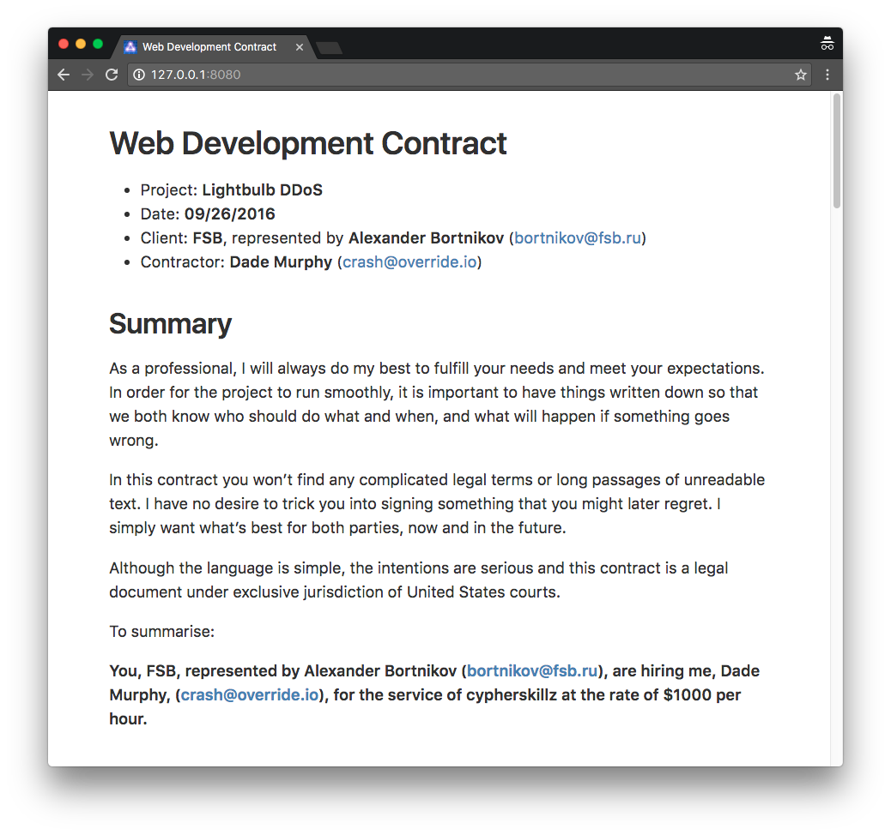
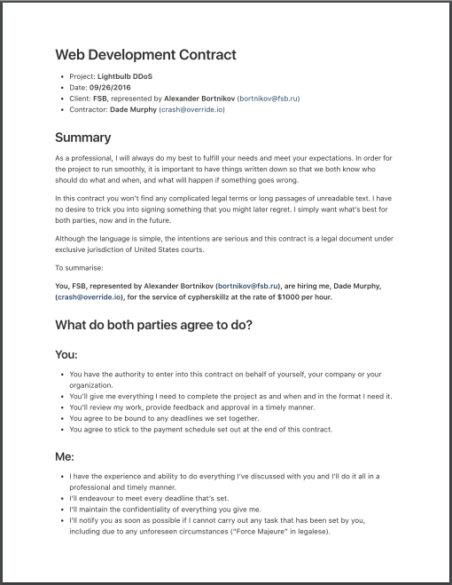

# Contracts

Generates a web development contract based on a template.

## Example

```
~/dev/git/contracts (master) $ npm start

> contracts@0.0.0 start /Users/ngoldman/dev/git/contracts
> run-s prompt generate serve


> contracts@0.0.0 prompt /Users/ngoldman/dev/git/contracts
> microgen templates/hourly.md build/index.md


project-name: Lightbulb DDoS
contract-date: 09/26/2016
client: FSB
contact-name: Alexander Bortnikov
contact-email: bortnikov@fsb.ru
my-name: Dade Murphy
my-email: crash@override.io
service-description: cypherskillz
hourly-rate: 1000
project-scope-description: DDoS krebsonsecurity.com using a botnet of smart light bulbs. If possible, blame Canada.
payment-deadline-in-days: 5
termination-notice-in-days: 1

> contracts@0.0.0 generate /Users/ngoldman/dev/git/contracts
> node index.js


> contracts@0.0.0 serve /Users/ngoldman/dev/git/contracts
> live-server build

Serving "build" at http://127.0.0.1:8080
```

### HTML output



### PDF output



## Install

```
git clone git@github.com:ungoldman/contracts.git
cd contracts
npm install
```

## Usage

```
npm start
```

Prompts for placeholder input, then generates a markdown file, html file, and pdf file.

## Templates

Templates files are plain markdown with handlebars placeholders (e.g. `{{my-variable}}`). The script uses [microgen](https://github.com/busterc/microgen) to prompt the user and generate a new filled out contract.

- **[Hourly](templates/hourly.md)**
  - adapted from [Hourly Contract Template: Web App](https://www.docracy.com/0rrdu39vkli/hourly-contract-template-web-app) by [fiznool](https://github.com/fiznool)
- :memo: [Create a new template](https://github.com/ungoldman/contracts/new/master/templates)

## License

[ISC](license.md)
